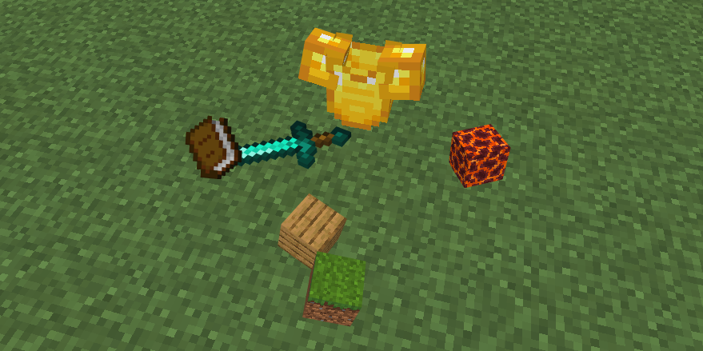

# DropItem3D
  
  
  
  
  
<span style="font-size:17px">PocketMine-MP plugin to be able to see drop items realistic.</span>  
　

## Configuration
```yaml
# How to pick up drop item.
## 0 : Like vanilla. (If you approach to item, you can pick up it)
## 1 : Click then pick up. (PC: Right click, Mobile: Tap)
drop-item-pickup: 0

# Drop armor item style.
## 0 : Like be equipping it.
## 1 : Like an item.
armor-drop-style: 0

# If you pick up an armor, what if it does?
## 0 : Equip it instantly.
## 1 : Add it to inventory.
armor-equip-instantly: 0
```  
　  
## Demo view
   

First demo = `drop-item-pickup: 0`  
Last demo = `drop-item-pickup: 1`
  
　  
## Todo
- [ ] To be able to retrieve the exact coordinates by click.
